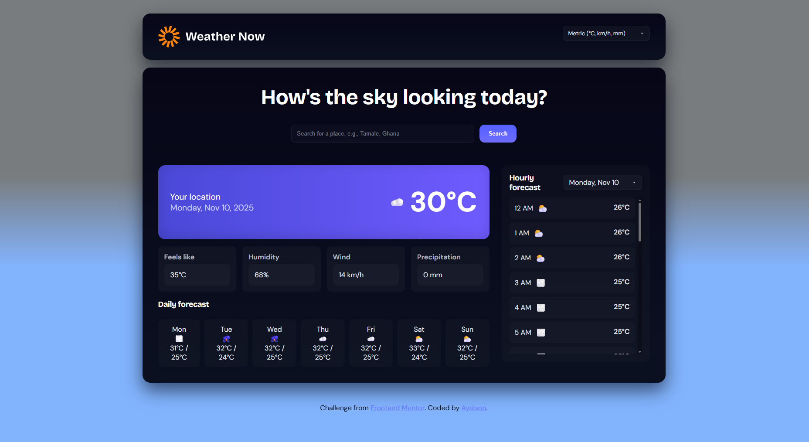
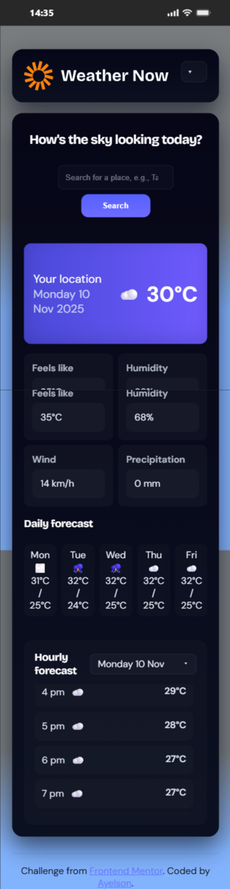

# Frontend Mentor - Weather app solution 1

This is a solution to the [Weather app challenge on Frontend Mentor](https://www.frontendmentor.io/challenges/weather-app-K1FhddVm49). Frontend Mentor challenges help you improve your coding skills by building realistic projects.

## Table of contents

- [Overview](#overview)
  - [The challenge](#the-challenge)
  - [Screenshot](#screenshot)
  - [Links](#links)
- [My process](#my-process)
  - [Built with](#built-with)
  - [Continued development](#continued-development)
  - [Author](#author)

## Overview
A responsive, accessible weather app that surfaces current conditions, hourly trends, and a 7‑day forecast for any searched location. The project focuses on clear information hierarchy, fast API-driven data fetches, and an intuitive, mobile-first UI that adapts seamlessly between small and large screens.

### Goals
- Provide fast, accurate weather data for user-entered locations with sensible fallbacks and error states.
- Offer both hourly and daily perspectives so users can plan short- and medium-term activities.
- Support unit toggling (metric/imperial) and preserve readable formatting across screen sizes.
- Prioritize accessibility (keyboard navigation, focus states, and sufficient contrast).

### Approach
- Mobile‑first layout with progressive enhancement for larger viewports.
- Componentized UI that separates search, current conditions, hourly selector, and weekly forecast for simpler state management and testing.
- Reduce API calls with basic caching and debounced search input; show clear loading and error UIs.
- Use semantic HTML and ARIA where needed to improve screen‑reader experience.

### Highlights
- Smooth unit switching without full-page reloads.
- Hourly selector that updates charts and details for the chosen day.
- Optimized assets and lazy loading for forecast images to improve initial load.

### Technical notes
- Fetches weather and forecast data from a public weather API (client-side requests with error handling).

### The challenge

- Built using plain HTML, CSS (custom properties), and vanilla JS for small bundle size and easy portability.
- Designed for further improvements: PWA support, persistent user preferences, and optional map integration.

Users should be able to:

- Search for weather information by entering a location in the search bar
- View current weather conditions including temperature, weather icon, and location details
- See additional weather metrics like "feels like" temperature, humidity percentage, wind speed, and precipitation amounts
- Browse a 7-day weather forecast with daily high/low temperatures and weather icons
- View an hourly forecast showing temperature changes throughout the day
- Switch between different days of the week using the day selector in the hourly forecast section
- Toggle between Imperial and Metric measurement units via the units dropdown 
- Switch between specific temperature units (Celsius and Fahrenheit) and measurement units for wind speed (km/h and mph) and precipitation (millimeters) via the units dropdown
- View the optimal layout for the interface depending on their device's screen size
- See hover and focus states for all interactive elements on the page

### Screenshots

**Note: Delete this note and the paragraphs above when you add your screenshot. If you prefer not to add a screenshot, feel free to remove this entire section.**

### Links

- Solution URL: [Add solution URL here](https://your-solution-url.com)
- Live Site URL: [Add live site URL here](https://your-live-site-url.com)

## My process

### Built with

- Semantic HTML5 markup
- CSS custom properties
- Mobile-first workflow

### Continued development

- Add persistent user settings (preferred units, home location, theme) using localStorage or IndexedDB
- Implement geolocation and one-tap "use my location" to auto-fetch weather
- Build a PWA with offline caching and a service worker for basic offline view and cached forecasts
- Improve accessibility (ARIA labels, keyboard navigation, focus states, contrast checks, screen reader testing)
- Add localization/i18n support (multiple languages and locale-specific number/date formatting)
- Show interactive charts for hourly and weekly trends (e.g., temperature, precipitation, wind) using a charting library
- Implement real-time updates or WebSocket fallback for live weather alerts and notifications
- Provide map integration (leaflet/Mapbox) for visualizing locations and weather overlays
- Add robust error handling and user-friendly fallback states for API failures and rate limits
- Optimize performance: bundle splitting, image optimization, lazy loading, and Lighthouse score improvements
- Introduce unit/integration tests (Jest, React Testing Library) and set up CI to run tests on push
- Add analytics and feature flags to measure usage and roll out experiments safely
- Support multiple APIs/fallback providers and implement caching/ETag handling to reduce requests
- Add animations and micro-interactions for transitions (prefer reduced-motion respect)
- Containerize or provide deployment scripts (Docker, GitHub Actions) for reproducible builds and automated deployments
- Implement server-side rendering or incremental static regeneration (Next.js) for improved SEO and first-load performance

## Author

- Website - [Ayel-son](https://Handson-a.github.io)
- Frontend Mentor - [Handson](https://www.frontendmentor.io/profile/Handson-A)

